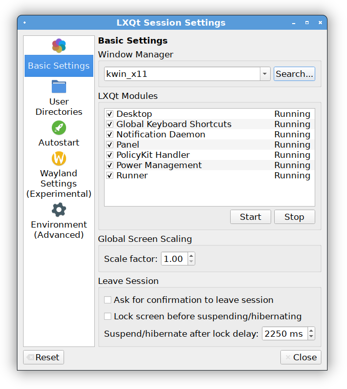

# lxqt-session

## Overview

### General

Repository lxqt-session is providing tools to handle LXQt sessions.

First of all there's session manager `lxqt-session`. The binary is launched right at the beginning of LXQt sessions and in turn responsible for launching and monitoring all other components constituting the sessions.  

GUI "LXQt Session Settings" (binary `lxqt-config-session`) is used to configure various settings affecting the session, e. g. which window manager to use or which applications to start automatically.  

Binary `lxqt-leave` deals with interrupting or terminating sessions. It comes with several options expressing the action they trigger, e. g. `--leave`, `--hibernate`, `--shutdown` or `--reboot`.  

### LXQt Modules

Term "LXQt Modules" refers to a way to launch binaries at the beginning of LXQt sessions and to make sure these will be available all over the session.  
Technically those binaries are basically launched according to the XDG [Autostart Specification](https://www.freedesktop.org/wiki/Specifications/autostart-spec/). But unlike binaries handled according to this specification only LXQt Modules are monitored all over the session and automatically relaunched should they exit unexpectedly.  

## Installation

### Compiling source code

Runtime dependencies are xdg-user-dirs, [liblxqt](https://github.com/lxqt/liblxqt), [qtxdg-tools](https://github.com/lxqt/qtxdg-tools) and layer-shell-qt.
Additional build dependencies are CMake and optionally Git to pull latest VCS checkouts.

Code configuration is handled by CMake. CMake variable `CMAKE_INSTALL_PREFIX` has to be set to `/usr` on most operating systems.  

To build run `make`, to install `make install` which accepts variable `DESTDIR` as usual.  

### Binary packages

Official binary packages are provided by all major Linux and BSD distributions. Just use your package manager to search for string `lxqt-session`.

## Configuration, Usage

### LXQt Modules

Basically these are launched by desktop entry files according to the [Autostart Specification](https://www.freedesktop.org/wiki/Specifications/autostart-spec/). An additional key `X-LXQt-Module=true` makes binary `lxqt-session` recognize the binary in question as an LXQt Module and treat as such.  
Corresponding configuration can be handled by "LXQt Session Settings", see below.  

### LXQt Session Settings

A GUI to tweak all kinds of settings affecting the session as a whole.

It can be launched from panel's main menu - Preferences - LXQt settings - Session Settings and is provided by "Configuration Center" (binary `lxqt-config`) of [lxqt-config](https://github.com/lxqt/lxqt-config) as well.  

Notes on some settings:

#### Basic Settings
Window Manager, LXQt Modules and some settings upon leaving the session. See screenshot. As for the LXQt Modules the checkbox at the left refers to launching the module at sessions' beginning, stopping and launching within running sessions works as well.  

#### Default Applications
Defines a default terminal emulator and web browser by setting environment variables `TERM` and `BROWSER`.  
The usage of `TERM` is faulty in this context, see [lxqt #433](https://github.com/lxqt/lxqt/issues/433). Usage of `BROWSER` is correct but not recognized by too many applications any longer.  
All in all the configuration of default applications will probably be handled by a different approach one day like improving GUI "File Associations" of [lxqt-config](https://github.com/lxqt/lxqt-config) so setting environment variables `TERM` and `BROWSER` with `lxqt-config-session` has actually to be discouraged.  

#### User Directories
This refers to defining directories in terms of the [xdg-user-dirs](https://www.freedesktop.org/wiki/Software/xdg-user-dirs/) concept. This is a specification to define a number of directories used for certain kinds of content like documents, audio or video files and to create those directories in each user's home directory in case they do not preexist.  
This dialogue allows for setting custom directory names differing from those defined by the specification.  

#### Autostart
Applications to launch according to the [Autostart Specification](https://www.freedesktop.org/wiki/Specifications/autostart-spec/).  
Term "LXQt Autostart" refers to applications launched in LXQt sessions only, "Global Autostart" to those launched in all kinds of session. The distinction is relying on keys `OnlyShowIn` and `NotShowIn` of the desktop entry files in use.  
The underlying desktop entry files can be edited manually, buttons `Add`, `Edit` and `Delete` at the right of pane "Autostart" can serve as some rudimentary editor, too.  

#### Wayland Settings (experimental)

Allows setting the compositor and the screenlocker under wayland. Will be shown only if [lxqt-wayland](https://github.com/lxqt/lxqt-wayland/) is installed.

#### Environment (Advanced)
Allows for setting arbitrary environment variables which will be available for all software running within LXQt sessions (so not only the components of LXQt itself).

### lxqt-leave

Desktop entry files providing the various invocations of the binary as depicted above are summed up in sub-menu "Leave" of the panel's main menu.  
Item "Leave" opens a dialogue window to select from all actions which are available, all other topics trigger the action stated by their title.  

### Translations

Translations can be done in [LXQt-Weblate](https://translate.lxqt-project.org/projects/lxqt-configuration/).

#### Components:

* [lxqt-session](https://translate.lxqt-project.org/projects/lxqt-configuration/lxqt-session)
* [lxqt-config-session](https://translate.lxqt-project.org/projects/lxqt-configuration/lxqt-config-session)
* [lxqt-leave](https://translate.lxqt-project.org/projects/lxqt-configuration/lxqt-config-leave)

